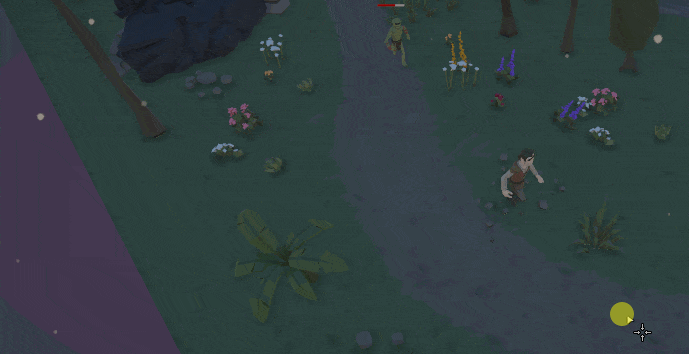
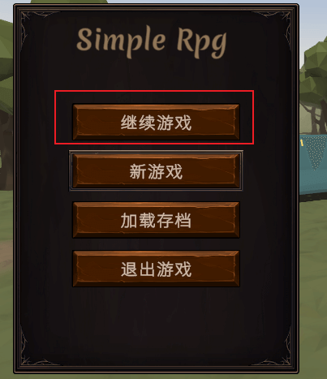

# Simple-RPG Unity游戏项目
## 项目概要
### 介绍

一个使用**Unity 3D**制作的**RPG**游戏DEMO，包括战斗、养成、对话、任务、道具装备、商店等系统。

- 基于**NavMesh**实现人物的移动，射线检测实现各种交互操作；
- **UGUI**实现各种界面（主菜单，背包，商店等等），使用编辑器内置的API实现对话编辑器；
- **Cinemachine**实现相机控制，**Timeline**进行细致控制；
- 使用Unity的**协程**实现各种操作，如场景异步加载，淡入淡出等；
- 使用**UnityEvent**，C# 原生event实现发布订阅模式，方便实现各种事件UI更新等；
- 使用Shader Graph实现一些简单的视觉效果；
- 动画的各种使用，使用Blend Tree，DOTween等等；
- 利用各种设计模式设计各个系统，保证系统设计的灵活性和可伸缩性；
- 使用git做项目版本控制。

### 仓库及文档信息
- 文档地址：
- DEMO下载：https://wwn.lanzout.com/iV4W609sjnpa
- Gitee仓库地址：
- GitHub仓库地址：https://github.com/chundot/simple-rpg

## 功能演示
### 基本功能
#### 移动

通过NavMesh和射线检测实现，无法移动的地方会以光标变化的方式展示。

#### 交互

使脚本实现IRaycastable接口即可实现光标的切换，以及各种事件的触发。

包括对话，捡起物品，攻击，进入商店等等。

#### 敌人AI

敌人可设置巡逻路线，默认为守卫。

玩家进入一定距离后触发敌意战斗。

被攻击时直接触发敌意，且会通知其他敌人。

脱战后原地呆滞，一段时间后回到守卫或巡逻模式。

### 对话系统
#### 编辑器

通过GUI的API实现简易的图形化对话文件编辑界面：

- 对话整体结构为由多个结点构成的树；
- 结点内部包含内容、触发器、条件判断等内容。

#### 游戏内展示

触发对话，对话进行，关闭对话；

分支选择：

可通过挂载DialogueTrigger实现对话触发各种功能，例如敌意攻击、任务接受等。

### 任务系统

获取任务可通过对话等方式触发。

UI面板显示接受的任务，任务进度，及详细奖励。

在任务完成时调用Inventory相关的API可获取奖励至背包。

### 道具系统
#### 背包

I键打开关闭背包：

可将背包内道具拖拽出，掉落至场景中：

#### 装备

O键打开或关闭装备栏；

拖拽背包内物品可装备，影响人物各种状态；

#### 快捷栏

可以将背包内道具拖拽到快捷栏使用，道具需要继承自ActionItem（包括技能、药剂等）。

### 技能系统

实现了各种各样的技能，攻击、恢复等等，同时有魔力消耗和冷却；

技能拖拽到快捷栏即可使用：

技能系统使用**策略模式**及**组合模式**构建，易于扩展。

### 商店系统

可购买及卖出对应物品，可以通过分类过滤搜索；

可通过脚本触发商店界面：

通过脚本直接控制商品类型及折扣率：

### 人物养成系统
#### 升级

通过一个Scriptable Object存储各角色各等级的所有信息（包括属性奖励、所需经验等等）：

#### 加点系统

按下C可打开人物属性的分配菜单，相应等级的点数存储在文件里。

不同属性出现不同效果（体力影响血量上限），同时扩展效果也非常容易：

### 存档功能

游戏中按下**F5**/**F6**可进行存/读档。

新游戏自定义存档文件名：

继续游戏可自动载入上一次存档：

此外，可在主菜单进行存档管理：

- 存档系统寻找挂载了SaveableEntity的物体调用其CaptureState（存取），RestoreState（读取）方法;
- SavableEntity在该物体寻找所有实现ISaveable的组件，调用其对应方法实现存读档；
- SavingSystem对数据进行序列化和反序列化。